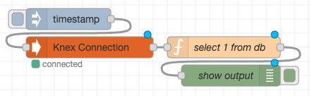

# Knex Nodered Connection

This Node-RED custom node provides a Knex instance for DB connections. (currently only working with Postgres)

## Configuration

- **URI**: The connection string for the PostgreSQL database.
- **SSL**: Whether to use SSL for the connection.
- **Timezone**: The timezone to set for the connection.
- **Pool Log**: Whether to log pool events.
- **Pool Min**: Minimum number of connections in the pool.
- **Pool Max**: Maximum number of connections in the pool.
- **Acquire Timeout Millis**: The time in milliseconds to wait for a connection to be acquired.
- **Create Timeout Millis**: The time in milliseconds to wait for a connection to be created.
- **Idle Timeout Millis**: The time in milliseconds to wait before an idle connection is released.
- **After Create Function**: A function to run after a connection is created.

## Example

You an checkout the example in [./example.json](https://github.com/ErickWendel/nodered-knex-connection/blob/main/example.json)

## Features
    - Reuses DB connections across nodes/flows
    - Terminate connections when they're not needed anymore
    - In case of deploying specific nodes, it doesn't change the running ones
    - Update node status every 200ms checking if the DB Connection is still valid

# Dependencies

It uses knex on 3.1.0 and pg on 8.12.0"